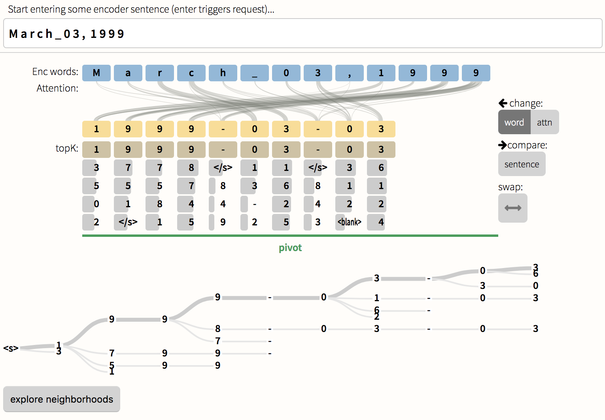

# Seq2Seq-Vis 
[](https://circleci.com/gh/sgratzl/Seq2Seq-Vis)
[](https://hub.docker.com/r/sgratzl/seq2seq-vis/)
[](https://opensource.org/licenses/Apache-2.0)
[ ](https://github.com/HendrikStrobelt/Seq2Seq-Vis/releases)


### A visual debugging tool for Sequence-to-Sequence models 
*by IBM Research in Cambridge and Harvard SEAS  -- more info [seq2seq-vis.io](http://seq2seq-vis.io)


- [Seq2Seq-Vis](#seq2seq-vis)
  * [Release Plan](#release-plan)
  * [Install and run with `conda`](#install-and-run-with-conda)
    + [1 - Install dependencies (server and client) and create virtual environment](#1---install-dependencies-server-and-client-and-create-virtual-environment)
    + [2 - Install custom OpenNMT-py version](#2---install-custom-opennmt-py-version)
    + [3 - Download some example data](#3---download-some-example-data)
    + [4 - Run the system](#4----run-the-system)
  * [Install and run with `docker`](#install-and-run-with-docker)
  * [Prepare and run own models](#prepare-and-run-own-models)
    + [1 - Prepare your data](#1---prepare-your-data)
    + [2 - Create a `s2s.yaml` file to describe project](#2---create-a-s2syaml-file-to-describe-project)
    + [3 - Command Line Parameters](#3---command-line-parameters)
- [Cite us](#cite-us)
- [Contributors](#contributors)
- [License](#license)


## Release Plan
- V 2.0 -- late 2019


## Install and run with `conda`

We require using [miniconda](https://conda.io/docs/user-guide/install/index.html) to create a virtual environment and install all dependencies via scripts. 
Seq2Seq-Vis currently works with a special version of OpenNMT-py modified version by [Sebastian Gehrmann](https://github.com/sebastianGehrmann/OpenNMT-py/tree/states_in_translation). We provide a script to install this special branch. 

### 1 - Install dependencies (server and client) and create virtual environment


```bash
git clone https://github.com/HendrikStrobelt/Seq2Seq-Vis.git
cd Seq2Seq-Vis
```

and run in `/Seq2Seq-Vis`:

```bash
source setup_cpu.sh
```

### 2 - Install custom OpenNMT-py version

```bash
cd ..
source Seq2Seq-Vis/setup_onmt_custom.sh
```

### 3 - Download some example data
Here we provide some example data for a character based dataset which converts date strings (e.g. "March 03, 1999" , "03/03/99") into a base form "mm-dd-yyyy".  [Download here ~177MB](https://drive.google.com/file/d/1myjJ-surrO76ImnLd4MMJ0-527Ss2e0V/view?usp=sharing) save it to `/Seq2Seq-Vis` and unzip:

```bash
unzip fakedates.zip
```

### 4 -  Run the system

```bash
python3 server.py --dir 0316-fakedates/
```
go here: [http://localhost:8080/client/index.html?in=M a r c h _ 0 3 , 1  9 9 9](http://localhost:8080/client/index.html?in=M%20a%20r%20c%20h%20_%200%203%20,%20%201%209%209%209)

You should see:



Enjoy exploring !


## Install and run with `docker`

Thanks, [Samuel Gratzl](https://github.com/sgratzl/Seq2Seq-Vis) for contributing a docker configuration and [image](https://hub.docker.com/r/sgratzl/seq2seq-vis/).
Here are the steps:

1. pull image: `docker pull sgratzl/seq2seq-vis`
2. download data [Download here ~177MB](https://drive.google.com/file/d/1myjJ-surrO76ImnLd4MMJ0-527Ss2e0V/view?usp=sharing)
and unzip: `unzip fakedates.zip`
3. run container with bound data: <br> `docker run --rm -it -v "${PWD}/0316-fakedates:/data" -p "8080:8080" sgratzl/seq2seq-vis` 


## Prepare and run own models

### 1 - Prepare your data
You can use any model trained with OpenNMT-py to extract your own data. To gain access to the extraction scripts, follow the instructions above to install the modified OpenNMT-py version. 


First, create a folder `s2s` that will be used to save all the extractions by calling `mkdir s2s`. 

Then, call 
```
python extract_context.py -src $your_input_file \
                          -tgt $your_target_file \
                          -model $your_model.pt \
                          -gpu $your_GPU_id (can be ignored for CPU extraction) \
                          -batch_size $your_batch_size
                          
```
You can customize the maximum sequence lengths by setting `max_src_len`, and `max_tgt_len` in the script. If you want to restrict the number of examples in your state file, you can uncomment the following lines and set it to your desrired size:
```
# if bcounter > 100:
#     break
```

The script creates a file in the location `s2s/states.h5`. This file is what you need to create the indices for searching.

The file for this is located in this directory in `scripts/h5_to_faiss.py`. 
Call it three times (once for each type of state) with the parameters 
```
-states s2s/states.h5 # Your states file location
-data [decoder_out, encoder_out, cstar] # The three datasets within the states h5 file
-output $your_index_name # We recommend just naming them decoder.faiss, encoder.faiss, and context.faiss
-stepsize 100 # you can increase this, this is the number of batches it will add to the index at once. It is bottlenecked by your memory
```

To generate the dictionary and embedding files, modify [this](https://github.com/sebastianGehrmann/OpenNMT-py/blob/states_in_translation/VisServer.py#L369) line with the location of your model and call

```
python VisServer.py
```
This will also test that your model works with our server as it calls the same API. The script will create three files:

- s2s/embs.h5
- s2s/src.dict
- s2s/tgt.dict


### 2 - Create a `s2s.yaml` file to describe project

```yaml
# -- minimal config 
model: date_acc_100.00_ppl_1.00_e7.pt  # model file
dicts:
 src: src.dict  		# source dictionary file
 tgt: tgt.dict  		# target dictionary file
embeddings: embs.h5  	# word embeddings for src and tgt
train: train.h5			# training data 

# -- OPTIONAL: FAISS indices for Neighborhoods
indexType: faiss		# index type should be 'faiss' (or 'annoy')
indices:
 decoder: decoder.faiss		# index for decoder states
 encoder: encoder.faiss		# index for encoder states

# -- OPTIONAL: model for linear projection
project_model: linear_projection.pkl		# pickl-ed scikit-learn model
```

### 3 - Command Line Parameters

```
usage: server.py [-h] [--nodebug NODEBUG] [--port PORT]
                 [-dir DIR]

optional arguments:
  --nodebug 	TRUE if not in debug mode
  --port 		port to run system (default: 8080)
  --dir  		directory with s2s.yaml file
```

# Cite us

```
@ARTICLE{seq2seqvisv1,
   author = {{Strobelt}, H. and {Gehrmann}, S. and {Behrisch}, M. and {Perer}, A. and {Pfister}, H. and {Rush}, A.~M.},
    title = "{Seq2Seq-Vis: A Visual Debugging Tool for Sequence-to-Sequence Models}",
  journal = {ArXiv e-prints},
archivePrefix = "arXiv",
   eprint = {1804.09299v1},
 primaryClass = "cs.CL",
 keywords = {Computer Science - Computation and Language, Computer Science - Artificial Intelligence, Computer Science - Neural and Evolutionary Computing},
     year = 2018,
    month = April
}
```

# Contributors

- Hendrik Strobelt (IBM Research & MIT-IBM Watson AI Lab)
- Sebastian Gehrmann (Harvard NLP)
- Alexander M. Rush  (Harvard NLP)

- Michael Behrisch (Harvard VCG), Adam Perer (IBM Research), Hanspeter Pfister (Harvard VCG)
- PR #16 signed-off-by: Samuel Gratzl 

# License

Seq2Seq-Vis is licensed under Apache 2 license.
